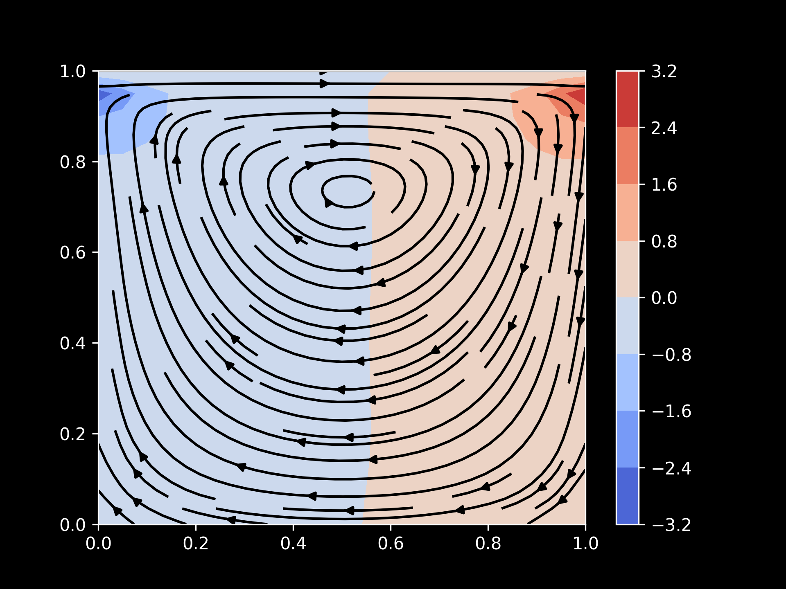

# Lid-Driven Cavity Flow Solver (Navier–Stokes)

A **2D Computational Fluid Dynamics (CFD) simulation** of incompressible fluid flow inside a square cavity using the **Navier–Stokes equations**.

The solver is implemented **from scratch in Python** using:

- Finite Difference Methods  
- Explicit time stepping  
- Chorin’s Projection Method for pressure–velocity coupling  

This project demonstrates key ideas in **numerical PDE solving, fluid dynamics simulation, and scientific computing**.

---

# Preview

Example simulation output:



The moving top wall drives the fluid, producing a **primary vortex inside the cavity**.

- Streamlines → velocity field  
- Color map → pressure distribution  

---

# Key Features

- Implementation of **incompressible Navier–Stokes equations**
- **Finite Difference discretization**
- **Pressure Poisson solver**
- **Chorin Projection Method**
- Stability-checked explicit time integration
- Velocity streamlines + pressure visualization
- Pure **NumPy implementation**

---

# Overview

The **lid-driven cavity problem** is a classical benchmark in computational fluid dynamics.

A square cavity contains fluid, and the **top wall moves horizontally**, dragging the fluid and generating circulation.

Over time, viscous effects produce a **primary vortex inside the cavity**.

This problem is widely used to validate numerical solvers for the **incompressible Navier–Stokes equations**.

---

# Governing Equations

The simulation solves the **incompressible Navier–Stokes equations**.

### Momentum Equation

```text
du/dt + (u · ∇)u = - (1/ρ) ∇p + ν ∇²u + f
```

### Incompressibility Condition

```
∇ · u = 0
```

Where:

| Symbol | Meaning |
|------|------|
| u | velocity vector |
| p | pressure |
| ν | kinematic viscosity |
| ρ | density |
| f | external force |
| ∇ | gradient/divergence operator |
| ∇² | Laplacian |

---

# Physical Setup

The simulation domain is a **unit square cavity**.

```
      → → → moving lid (constant velocity)

1.0 +--------------------------------+
    |                                |
    |                                |
    |                                |
    |                                |
    |                                |
    |                                |
    |                                |
0.0 +--------------------------------+
    0.0                              1.0
```

Boundary conditions:

| Boundary | Condition |
|--------|--------|
| Top wall | constant horizontal velocity |
| Bottom wall | u = 0 , v = 0 |
| Left wall | u = 0 , v = 0 |
| Right wall | u = 0 , v = 0 |

Initial condition:

```
u = 0
v = 0
p = 0
```

---

# Numerical Method

The solver uses **Chorin’s Projection Method**.

### Step 1 — Tentative Velocity

```
du/dt + (u · ∇)u = ν ∇²u
```

---

### Step 2 — Pressure Poisson Equation

```
∇²p = ρ/Δt (∇ · u)
```

This enforces the **divergence-free constraint**.

---

### Step 3 — Velocity Correction

```
u ← u − (Δt/ρ) ∇p
```

The corrected velocity field satisfies **incompressibility**.

---

# Numerical Implementation

| Method | Purpose |
|------|------|
| Finite Difference | spatial discretization |
| Central Differences | gradients and divergence |
| Explicit Time Stepping | time integration |
| Iterative Poisson Solver | pressure calculation |
| Streamline Plot | flow visualization |

Grid resolution used:

```
41 × 41 grid
```

---

# Stability Condition

Explicit schemes require a stable timestep:

```
Δt ≤ (0.5 × Δx²) / ν
```

The code checks this condition automatically to prevent unstable simulations.

---

# Project Structure

```
lid-driven-cavity/
│
├── lid_driven_cavity_python_simple.py
├── lid_driven_cavity_result.png
└── README.md
```

---

# Requirements

Python **3.8+**

Install dependencies:

```
pip install numpy matplotlib tqdm
```

---

# Running the Simulation

Run the solver:

```
python lid_driven_cavity_python_simple.py
```

The script will:

1. run the CFD simulation  
2. compute velocity and pressure fields  
3. generate visualization  
4. save the result  

Output file:

```
lid_driven_cavity_result.png
```

---

# What This Project Demonstrates

This project showcases understanding of:

- numerical solution of **partial differential equations**
- simulation of **Navier–Stokes fluid flow**
- **finite difference discretization**
- **pressure–velocity coupling**
- scientific visualization

It serves as a compact example of a **CFD solver implemented from scratch**.

---

# Possible Extensions

Potential improvements include:

- higher grid resolution
- Reynolds number studies
- comparison with **Ghia et al. benchmark data**
- faster Poisson solvers (Jacobi / Gauss–Seidel / multigrid)
- GPU acceleration

---

# References

- Chorin, A. J. (1968) — *Numerical Solution of the Navier–Stokes Equations*  
- Ghia, U., Ghia, K., Shin, C. (1982) — *High-Re solutions for incompressible cavity flow*

---

# Author

**Hetram** 